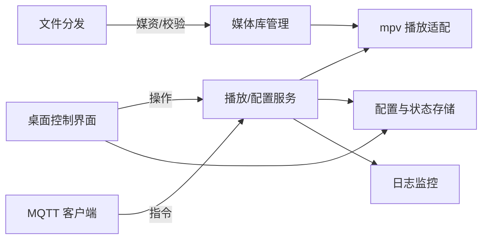
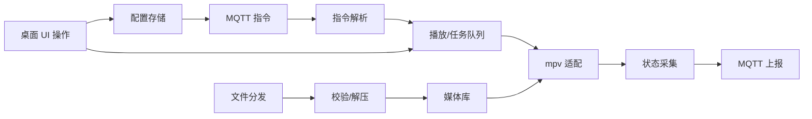

## 产品概述

在麒麟系统上基于 Python 与 mpv 构建广告屏播放器，保持与 ohosPlayer 相同的 MQTT 主题/命令与文件分发协议，并提供本地桌面窗口控制界面。

## 核心特性

- MQTT 指令监听与解析，覆盖播放控制、状态上报、文件分发同步
- mpv 播放核心：支持循环播放、预加载、异常重启、音量/静音控制
- 本地媒体库管理：文件分发落盘、校验、任务进度与错误重试
- 桌面控制界面：播放列表管理、播放状态与系统资源监测、网络/MQTT 连接状态可视化
- 配置管理：MQTT 连接参数、本地缓存路径、日志与自启动开关可视化配置

## 技术选型

- 语言/运行时：Python
- 播放引擎：mpv（通过 Python 绑定）
- 桌面端：跨平台 UI 框架（含窗口、表格、图表、托盘图标）
- 通信：MQTT 客户端，文件分发复用 ohosPlayer 协议
- 存储：本地文件系统 + 配置/状态文件（JSON/YAML/SQLite）
- 日志与监控：本地滚动日志，异常自动恢复

## 系统架构

- 分层结构：接口层（MQTT/文件分发、本地 UI）、业务层（播放调度、任务管理、配置管理）、基础层（mpv 适配、存储、日志）



## 模块划分

- MQTT/指令模块：连接、重连、主题/命令对齐 ohosPlayer，状态上报
- 文件分发模块：下载、校验、解压、落盘与回执
- 播放调度模块：mpv 适配、播放队列、异常重启、音量/静音
- 配置与存储模块：MQTT 参数、路径、日志级别、自启动；状态与缓存
- 桌面 UI 模块：播放列表、状态监控、任务进度、连接/资源可视化、托盘控制
- 日志与监控模块：本地滚动日志、错误告警钩子

## 数据流



## 目录结构（新增/主要）

```
project-root/
├── src/
│   ├── mqtt/             # MQTT 连接与指令解析
│   ├── file_dist/        # 文件分发与校验
│   ├── player/           # mpv 适配与播放调度
│   ├── ui/               # 桌面窗口与控件
│   ├── config/           # 配置加载/保存
│   └── utils/            # 日志、校验、重试
```

## 关键结构

- 播放任务：{id, uri/path, duration, checksum, priority, expireAt, volume}
- MQTT 命令：{topic, cmd, payload}，映射到播放/下载/配置操作
- 状态上报：{playerState, currentMedia, progress, volume, netStatus, errors}

### 设计思路

桌面控制界面采用深色科技风，分为侧边导航与主工作区；使用卡片化布局呈现播放列表、状态监控与任务进度，顶部提供全局连接状态与快捷控制，底部固定托盘操作区，交互含悬停高亮与进度动画。

## 可用扩展

- **code-explorer (SubAgent)**
- Purpose: 全局检索现有仓库结构与关键代码，快速定位复用点
- Expected outcome: 生成项目结构与可复用文件的清单，指导后续开发