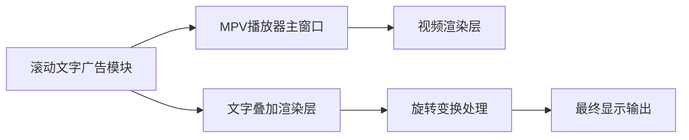

## 产品概述

在MPV播放器中实现滚动文字广告功能，支持屏幕旋转90度时的特殊显示需求

## 核心功能

- 滚动文字广告显示：支持在视频播放时叠加显示滚动文字广告
- 屏幕旋转适配：屏幕实际逆时针旋转90度放置时，文字从右向左滚动显示
- 开发调试模式：开发时文字从屏幕画面最右侧从下往上滚动显示，便于调试
- 广告内容管理：支持动态更新广告文字内容、字体、颜色、滚动速度等参数
- 叠加显示控制：可以控制广告文字是否显示，以及显示位置的调整

## 技术栈

- 前端框架：PySide6 (Qt for Python)
- 图形渲染：OpenGL或Qt Graphics View框架
- 文字渲染：Qt文本渲染引擎
- 动画处理：Qt动画框架

## 技术架构

### 系统架构



### 模块划分

- **广告管理器模块**：负责广告内容管理、显示参数配置
- **文字渲染模块**：处理文字渲染、字体样式、颜色设置
- **动画控制器模块**：控制滚动动画效果和速度
- **旋转适配模块**：处理屏幕旋转90度时的显示适配

### 数据流

用户配置广告内容 → 广告管理器解析参数 → 文字渲染模块生成文字图像 → 动画控制器应用滚动效果 → 旋转适配模块处理屏幕旋转 → 叠加到视频画面显示

## 实现细节

### 核心目录结构

```
d:/code/mpvPlayer/
├── src/
│   ├── ui/
│   │   ├── main_window.py              # 修改主窗口以集成广告功能
│   │   └── scrolling_text_ad.py        # 新增：滚动文字广告组件
│   ├── player/
│   │   └── mpv_controller.py           # 修改：支持文字叠加显示
│   └── config/
│       └── models.py                   # 新增：广告配置模型
```

### 关键技术实现

1. **文字叠加技术**：使用Qt的QPainter在视频画面上叠加渲染文字
2. **动画控制**：使用QPropertyAnimation控制文字位置变化
3. **旋转适配**：通过坐标变换矩阵实现屏幕旋转90度的适配
4. **性能优化**：使用双缓冲技术避免闪烁，优化文字渲染性能

### 技术难点解决

- **文字平滑滚动**：使用线性插值动画确保滚动流畅
- **旋转显示适配**：通过坐标变换实现开发模式与生产模式的统一
- **资源管理**：动态加载字体资源，支持多语言文字显示