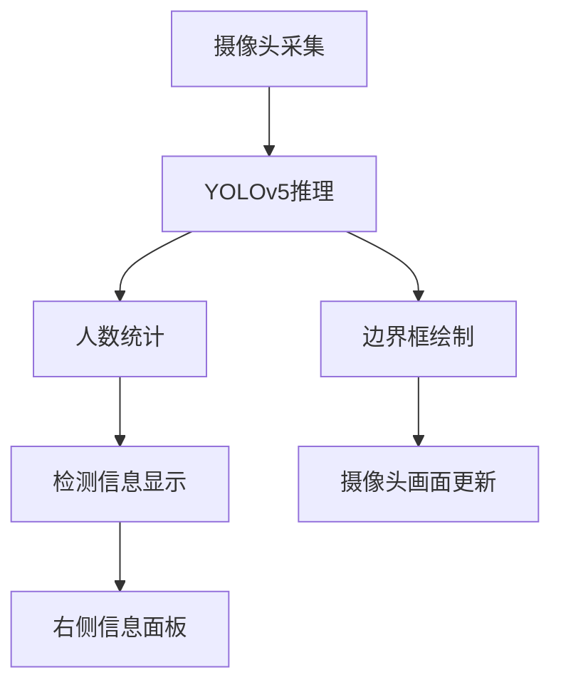

## 产品概述

基于YOLOv5 ONNX模型开发的电梯内人数识别模块，集成到现有摄像头控制器中，实时检测电梯内人数并提供完整的检测信息显示。

## 核心功能

- **实时人数检测**: 使用YOLOv5 ONNX模型对摄像头画面进行实时人数识别
- **检测信息显示**: 在摄像头窗口右侧显示完整检测信息，包括人数统计、置信度、位置坐标、帧率等
- **高精度优先**: 采用高精度优先策略，确保识别准确率
- **实时显示不保存**: 仅实时显示检测结果，不保存历史数据
- **集成现有框架**: 无缝集成到现有的CameraController摄像头控制器中

## 技术栈

- **深度学习框架**: YOLOv5 ONNX模型（性能最优）
- **图像处理**: OpenCV (已集成)
- **界面框架**: PySide6 (已集成)
- **推理引擎**: ONNX Runtime

## 技术架构

### 系统架构



### 模块划分

- **YOLOv5推理模块**: 加载ONNX模型，执行实时目标检测
- **人数统计模块**: 统计检测到的人数，过滤低置信度检测
- **信息显示模块**: 在摄像头窗口右侧显示检测信息面板
- **集成模块**: 将人数识别功能集成到现有CameraController中

### 数据流

摄像头画面 → YOLOv5推理 → 人数统计 → 检测信息显示 → 界面更新

## 实现细节

### 核心目录结构

```
src/
├── player/
│   ├── camera_controller.py       # 现有摄像头控制器（需修改）
│   └── yolov5_detector.py         # 新增：YOLOv5人数检测模块
├── models/
│   └── yolov5_elevator.onnx       # YOLOv5 ONNX模型文件
└── utils/
    └── detection_utils.py          # 新增：检测相关工具函数
```

### 关键技术实现

**YOLOv5Detector类**: 负责加载ONNX模型，执行实时人数检测，提供检测结果和统计信息。

```python
class YOLOv5Detector:
    def __init__(self, model_path: str, conf_threshold: float = 0.5):
        self.model = self._load_onnx_model(model_path)
        self.conf_threshold = conf_threshold
    
    def detect_people(self, frame: np.ndarray) -> DetectionResult:
        """检测图像中的人数"""
        # 预处理图像
        # 执行ONNX推理
        # 后处理检测结果
        # 返回人数统计和检测信息
```

**检测信息显示组件**: 在摄像头窗口右侧显示实时检测信息。

```python
class DetectionInfoPanel(QtWidgets.QWidget):
    def __init__(self):
        super().__init__()
        # 创建人数、置信度、帧率等显示组件
    
    def update_info(self, detection_result: DetectionResult):
        """更新检测信息显示"""
```

## 技术考虑

### 性能优化

- 使用ONNX Runtime进行高效推理
- 优化图像预处理和后处理流程
- 合理设置检测间隔以平衡性能和精度

### 集成策略

- 保持现有CameraController接口不变
- 通过配置开关控制人数识别功能的启用/禁用
- 确保不影响现有摄像头功能