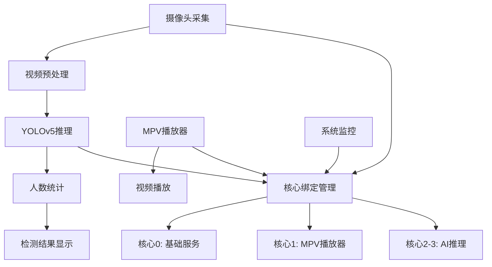

## 产品概述

基于YOLOv5 ONNX模型的电梯内人数识别模块，集成到现有MPV播放器系统中，实现实时人数统计和显示功能。

## 核心功能

- **实时人数识别**: 使用YOLOv5 ONNX模型对摄像头视频流进行实时人数检测
- **多核绑核优化**: 在飞腾E2000 4核处理器上实现核心资源分配优化
- **检测信息显示**: 在摄像头窗口右侧实时显示人数统计和检测框信息
- **资源管理**: 合理分配CPU核心资源，确保摄像头采集、MPV播放器和AI推理的稳定运行

## 技术栈选择

- **AI推理框架**: ONNX Runtime (CPU模式)
- **计算机视觉**: OpenCV-Python (已集成)
- **多核优化**: Python threading + psutil库
- **集成架构**: 基于现有MPV播放器的模块化架构

## 系统架构



### 模块划分

- **摄像头采集模块**: 负责视频流采集和预处理
- **YOLOv5推理模块**: 基于ONNX模型的实时人数检测
- **人数统计模块**: 统计电梯内人数并记录历史数据
- **核心绑定模块**: 管理CPU核心资源分配
- **显示模块**: 在UI界面显示检测结果

## 实现细节

### 核心目录结构

```
mpvPlayer/
├── src/
│   ├── ai/
│   │   ├── __init__.py
│   │   ├── yolo_detector.py        # YOLOv5检测器
│   │   ├── people_counter.py       # 人数统计模块
│   │   └── core_binding.py         # 核心绑定管理
│   ├── camera/
│   │   ├── __init__.py
│   │   └── camera_capture.py       # 摄像头采集模块
│   ├── ui/
│   │   ├── __init__.py
│   │   └── detection_display.py    # 检测结果显示组件
│   └── app.py (修改)                # 集成AI模块到主应用
├── models/
│   └── yolov5s.onnx                # YOLOv5 ONNX模型文件
└── requirements.txt (更新)          # 添加新依赖
```

### 关键代码结构

**YOLOv5检测器接口**:

```python
class YOLOv5Detector:
    def __init__(self, model_path: str, core_affinity: List[int] = None):
        self.model = onnxruntime.InferenceSession(model_path)
        self.core_binding = core_affinity
        
    def detect_people(self, frame) -> List[Detection]:
        """检测人员并返回检测框"""
        
    def get_person_count(self, frame) -> int:
        """获取当前帧中的人数"""
```

**核心绑定管理器**:

```python
class CoreBindingManager:
    def __init__(self):
        self.cpu_count = psutil.cpu_count()
        
    def bind_to_cores(self, process_pid: int, cores: List[int]):
        """将进程绑定到指定CPU核心"""
        
    def optimize_core_allocation(self):
        """优化核心分配策略"""
```

### 技术实现计划

1. **模型集成**: 集成YOLOv5 ONNX模型到现有架构
2. **多线程处理**: 实现摄像头采集和AI推理的并行处理
3. **核心绑定**: 使用psutil实现进程到CPU核心的绑定
4. **UI集成**: 在现有UI界面中添加检测结果显示区域
5. **性能优化**: 优化内存使用和推理速度

## 性能优化

- **模型优化**: 使用YOLOv5s轻量级模型减少计算量
- **批处理**: 实现多帧批处理提高推理效率
- **内存复用**: 减少内存分配和拷贝操作
- **异步处理**: 实现采集、推理、显示的异步流水线

## 代理扩展

### SubAgent

- **code-explorer**
- 目的: 深度分析现有代码结构，确保新模块与现有架构的无缝集成
- 预期结果: 发现最佳集成点和潜在的兼容性问题